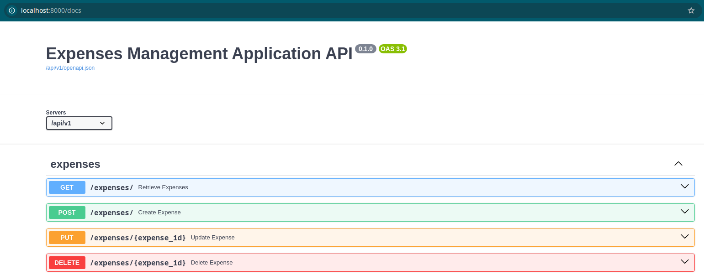

# Expense tracker bot

## Table of Contents

- [Task](#task)
- [Installation](#installation)
- [Run with docker](#run-with-docker)
- [Run migrations](#run-migrations)
<!-- - [Run tests](#run-tests) -->
- [Getting access](#getting-access)
- [Tech Stack](#tech-stack)
- [Features](#features)
<!-- - [DB Structure](#db-structure) -->

## Task
This project involves creating a Telegram bot for expense tracking with a FastAPI server. The server provides an API to manage expenses, including endpoints for adding, editing, deleting, and retrieving expense records, with support for currency conversion using real-time exchange rates. The Telegram bot allows users to interact with the API.

## Installation

```bash
git clone https://github.com/AlexTsikhun/expense-tracking-telegram-bot
cd expense-tracking-telegram-bot
# SET ENV VARS, see `.env.sample` 
```

## Run with docker

```bash
docker compose build
docker compose up
```

Docker should be installed locally

## Run migrations

Run the Alembic Command:

```bash
alembic revision --autogenerate -m 'Initial migration'"
```

Apply Migrations:

```bash
alembic upgrade head
```


<!-- ## Run tests

Add path to `.env` files for test configuration

```bash
PYTHONPATH=$PYTHONPATH:src pytest --asyncio-mode=auto -sv
``` -->

## Getting access

- API Root `api/v1/`
- Docs: `api/v1/docs`

## Tech Stack

- FastAPI
- Aiogram
- SQLite
- SQLAlchemy
- Alembic
- Docker & Docker Compose
- Pydantic

## Features:

- CRUD operations for books and authors
- Asynchronous sqlite database with SQLAlchemy ORM
- Docker containerization

<!-- 
#### DB Structure:

 -->


Swager docs image:



<details style="border: 1px solid #ccc; padding: 10px; margin-bottom: 10px">
<summary style="font-size: 1.17em; font-weight: bold; ">Future work</summary>

- Make it more comfortable to view the csv file (so as not to download it every time)

</details>
